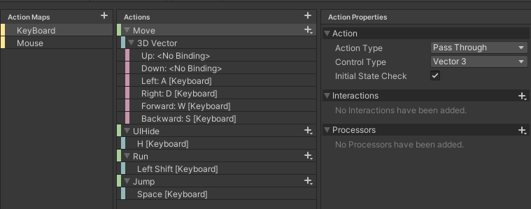

Unity New input System
======================
>## 프로젝트 설정
    1. Package Manager 에서 NewInputSystem 설치
    2. Project Setting - Player - OtherSetting - Configuration - Active input Handling 을 Both 또는 Input System Package(New)로 변경

>## InputActions 생성
    1. Project 폴더에서 우클릭 - Create - InputActions 생성
    2. 생성된 InputAction 더블클릭 후 Input Binding

>## C#파일 생성
    1. InputAction 파일 클릭 Generate C# Class 체크 및 Apply

>## 사용 설정
```C#
NewInputSetting input;
private void OnEnable()
{
    input.Enable();
}

private void OnDisable()
{
    input.Disable();
}
private void Awake()
{
    input = new NewInputSetting();
}
```
>## 이벤트 할당
```C#
//ActionMap Keyboard 의 Action Move에 이벤트 할당
input.KeyBoard.Move.performed += OnMove;
public void OnMove(InputAction.CallbackContext context)
{
    Vecotor3 inputDirKey = context.ReadValue<Vector3>();
}
위와 같이 작성시 WASD키를 입력시마다 해당방향에 맞는 Vector3값을 input으로부터 ReadValue를 통해 읽어들인다.

input.KeyBoard.Jump.started += (context) =>
{
    Input_Jump?.Invoke();
};
람다식으로 할당도 가능하다.
```
>## InputActionType


    1. Value : 바인딩된 인풋에서 단일값을 읽는 액션, 액션이 시작될때 Started, 기본값에서 다른값으로 변경시 Perfomed , 기본값으로 돌아오면 Canceled가 호출
    2. Button : 액션의 트리거 역할, Perfomed가 호출안되며 Started와 Canceled가 호출된다.
    3. PassThrough : Perfomed만 호출되는 액션, 기본값으로 되돌아오는것과 상관없이 값이 변경될때마다 호출된다.
